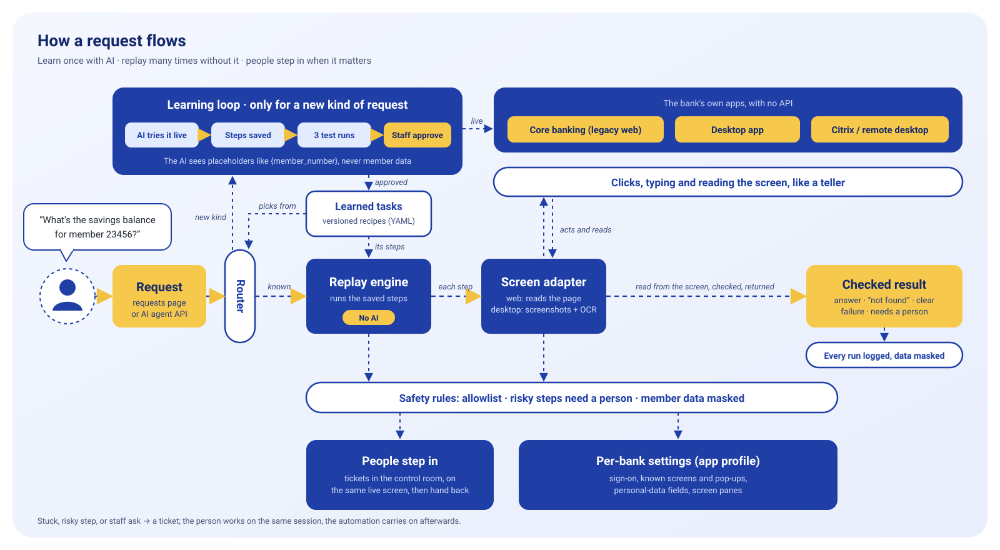

# UI Automation System

Old bank systems often have no API, so the only way in is the screen. This project lets an AI learn a task on such a screen **once**, saves what it did as a reviewed recipe, and from then on **replays that recipe with no AI**: same steps every time, with clear answers, sensible handling of problems, and a person brought in when it matters.

The target is a mock legacy core-banking app (built for this project, synthetic data) that is deliberately hard to automate. The AI never sees member data.



- **Design and trade-offs:** [REPORT.md](REPORT.md)
- **Recorded runs** (31 scenarios): [evidence/](evidence/README.md)

## Quick start

Python 3.11 or newer, on macOS, Linux or Windows.

```bash
python3 -m venv .venv                # Windows: py -m venv .venv
source .venv/bin/activate            # Windows: .venv\Scripts\activate
pip install -e ".[dev,pixel]"        # "pixel" adds OCR for the no-DOM mode; optional
playwright install chromium
ui-automation demo
```

Two pages open in your browser:

- **Member requests** (`http://127.0.0.1:8001/ask`): ask a question in plain words, get the answer. For demos it also shows the bank screen as the system works.
- **Control room** (`http://127.0.0.1:8001/control`): for staff. **Tickets** (help a paused request), **Activity** (every request, step by step), **Learned tasks** (review and approve recipes), **Demo tools** (make the next request hit a problem).

**No API key needed.** Known requests replay with no AI, and the example requests learn from prepared steps. To let Gemini learn new kinds of request, add `GEMINI_API_KEY=...` to a `.env` file (see [.env.example](.env.example)).

If port 8000 is already taken (Docker often uses it), run `UI_AUTOMATION_BANK_PORT=8100 ui-automation demo`, or put that line in `.env`.

## Try it (5 minutes)

Type your name at the top of the control room first; it's shown on the tickets you handle.

1. **A known request.** Ask *What's the savings balance for member 23456?* It replays saved steps with no AI: **$15,002.75**.
2. **A business answer.** Ask about member *99999*: "No member was found". An answer, not a crash.
3. **A problem it handles.** In Demo tools click *Maintenance notice*, then ask again. It dismisses the notice and carries on.
4. **A person steps in.** Click *Asks for a one-time code*, ask again, and open **Tickets (1)**. Take the ticket, type the code from the supervisor's device on the screen, then *Hand back to automation*.
5. **An approval.** Ask to *open a REGULAR SAVINGS sub-account…* (an example button). It stops before Confirm; you click Confirm yourself, or *Don't do it*.
6. **Something new.** Ask *Read the checking account available balance for member 12345*. It's learned, tested three times, and waits in **Learned tasks**. Approve it, ask again for member 23456: now it's reused with no AI.

Tip: *Demo tools → Speed → Slow* makes each click easy to follow.

## The same flow from the command line

Learn a task on a goal, then replay the saved recipe. Keep `ui-automation demo` running in one terminal (it starts the mock bank) and use a second one:

```bash
# 1. learn: offline with prepared decisions (drop --script to let Gemini decide)
ui-automation discover "Read the checking account available balance for member 12345" \
    --script scripted_discovery/get_checking_available_balance.yaml

# 2. review and approve the draft it saved
ui-automation capabilities
ui-automation show get_checking_available_balance
ui-automation approve get_checking_available_balance

# 3. replay with no AI, for another member
ui-automation replay get_checking_available_balance -p member_number=23456
```

With Gemini, the AI picks the task and input names; `ui-automation capabilities` shows them.

More replays to try:

```bash
ui-automation replay get_savings_balance -p member_number=12345     # success
ui-automation replay get_savings_balance -p member_number=99999     # business answer: not found
ui-automation replay get_savings_balance -p member_number=70000     # failure, with a masked screenshot
ui-automation fault expire_after=2                                  # next run: session expires halfway
ui-automation replay get_savings_balance -p member_number=12345     # recovers: signs in again
ui-automation replay get_savings_balance -p member_number=23456 --surface pixel   # no DOM: screenshots + OCR
```

Exit codes: `0` success or business answer, `1` failed, `3` needed a person. Add `--headed` to watch the browser. Each run writes a masked log to `runs/` (not committed).

## Running without live services

Everything runs locally: the mock bank, the browser and the web pages. Without a Gemini key, replay works as normal (it never uses AI), and learning uses the prepared decision files in `scripted_discovery/`, clearly labelled as scripted. Only discovering a genuinely new task needs the key.

## For an AI agent

While the demo runs, approved recipes are offered as tools:

```bash
curl http://127.0.0.1:8001/api/tools
curl -X POST http://127.0.0.1:8001/api/capabilities/get_savings_balance/invoke \
     -H 'content-type: application/json' -d '{"inputs": {"member_number": "23456"}}'
```

The answer follows [schemas/run_result.schema.json](schemas/run_result.schema.json).

## Tests and evidence

```bash
pytest                                       # 87 tests: unit + end-to-end in a real browser
pytest -m "not integration"                  # unit tests only, under a second
python scripts/generate_evidence.py          # rebuild evidence/ (add --offline to skip Gemini)
```

## Settings

All optional, in `.env`:

| Variable | What for | Default |
|---|---|---|
| `GEMINI_API_KEY` | learning new tasks, and picking a task for a request | none |
| `UI_AUTOMATION_BANK_PORT` / `UI_AUTOMATION_OPERATOR_PORT` | ports of the mock bank / the web pages | 8000 / 8001 |
| `UI_AUTOMATION_DISCOVERY_MODEL` | the Gemini model | `gemini-3.8-flash` (with fallbacks) |

Timeouts and other values are named in [settings.py](src/ui_automation/settings.py).

## Project layout

```
src/ui_automation/
  discovery/        the AI learning a task (with the privacy layer)
  replay/           running a saved recipe with no AI
  screen/           doing steps on screen: web (DOM) or pixels (screenshots + OCR)
  catalog/          saved recipes, request router, review, agent tools
  human_handoff/    tickets and who controls the session
  safety/           allowlist, risky steps, masking
  web/              the requests page and the control room
  models/           the recipe, app profile and result formats
mock_bank/          the target app
config/             app profile (per bank) and safety policy
capabilities/       approved recipes, one YAML file per version
scripted_discovery/ prepared decisions for offline learning
tests/              unit and end-to-end tests
evidence/           recorded runs (generated)
```
